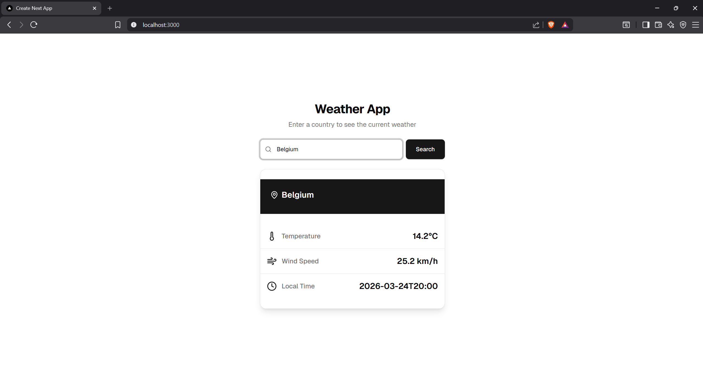

# Weer & Landen Applicatie (Weather Country App)

Dit project is een gedistribueerde webapplicatie gebaseerd op een microservices-architectuur. Het systeem haalt externe gegevens over landen en het actuele weer op, verwerkt deze asynchroon, en presenteert ze via een moderne webinterface aan de gebruiker.



*Lees dit in andere talen: [Engels](README.md).*

## Architectuur & Componenten

Het project bestaat uit de volgende hoofdonderdelen:

- **Weather Country UI**: De frontend gebouwd met **Next.js / React** en TypeScript. Deze communiceert direct met de interne API om de data grafisch weer te geven.
- **Weather Country API**: Een backend-service gebouwd in **Quarkus** (Java). Deze API handelt de verzoeken van de interface af en leest/schrijft gegevens in de database.
- **Weather Country Worker**: Een lossgekoppelde achtergronddienst (eveneens **Quarkus**) die communiceert met externe diensten zoals de *REST Countries API* en de *Open-Meteo API* om databerichten binnen te halen of te updaten.
- **Infrastructuur**:
  - **PostgreSQL**: Een relationele database voor stabiele data-opslag.
  - **Apache ActiveMQ Artemis**: Een message broker (AMQP) die zorgt voor snelle en asynchrone communicatie tussen de API en de Worker.
  
## Installatie & Opstarten

Kloon eerst de repository naar je lokale machine via de terminal:

```
git clone https://github.com/PeterBosmanBE/weather-country-async-system
```

Navigeer vervolgens naar de nieuwe map:

```
cd weather-country-async-system
```

Start de applicatie met Docker Compose:

```
docker compose up --build -d
```
## De Applicatie Openen
Zodra alle containers actief zijn, is de applicatie bereikbaar via:

- Frontend / UI: http://localhost:3000
- Backend API: http://localhost:8080

## API Reference

### Interne API (Weather Country API)

Dit zijn de REST-eindpunten die worden blootgesteld door de backend Quarkus-applicatie, standaard bereikbaar via `http://localhost:8080`.

#### Nieuw weerverzoek aanmaken

```http
  POST /weather
```

| Parameter | Locatie  | Type     | Omschrijving               |
| :-------- | :------- | :------- | :------------------------- |
|  `body`   | `body`   | `string` | **Verplicht**. De naam van het land/locatie. |

Actie: Maakt een nieuw weerverzoek aan in de database en stuurt een bericht naar de ActiveMQ-makelaar zodat de
worker het kan verwerken. Retourneert het databaseobject met een uniek ID.

#### Status van een verzoek ophalen

```http
  GET /weather/${id}/status
```

| Parameter | Locatie  | Type     | Omschrijving                      |
| :-------- | :------- | :------- | :-------------------------------- |
| `id`      | `pad`    | `string` | **Verplicht**. Het ID van het weerverzoek om te controleren. |

Actie: Retourneert de huidige verwerkingsstatus van het verzoek (bijv. PENDING, COMPLETED, FAILED).

#### Eindresultaat ophalen

```http
  GET /weather/${id}/result
```

| Parameter | Locatie  | Type     | Omschrijving               |
| :-------- | :------- | :------- | :------------------------- |
|   `id`    | `path`   | `string` | **Verplicht**. Het ID van het weerverzoek om op te halen |

Actie: Retourneert de opgehaalde weer- en landengegevens in JSON-formaat zodra de worker de verwerking succesvol heeft afgerond.

## Externe API's (gebruikt door de Worker)
De achtergrondworker roept automatisch de volgende publieke API's aan bij het verwerken van een verzoek. Er zijn geen API-sleutels nodig, sinds ze publiek zijn:

### REST Countries API

```http
  GET https://restcountries.com/v3.1/name/${location}
```

Actie: Haalt landengegevens op (zoals breedte- en lengtegraadcoördinaten) op basis van de locatienaam ingevoerd door de gebruiker.

### Open-Meteo API

```http
  GET https://api.open-meteo.com/v1/forecast?latitude=${lat}&longitude=${lon}&current_weather=true
```

Actie: Gebruikt de coördinaten van de REST Countries API om de actuele weersomstandigheden op te halen voor die geografische locatie.